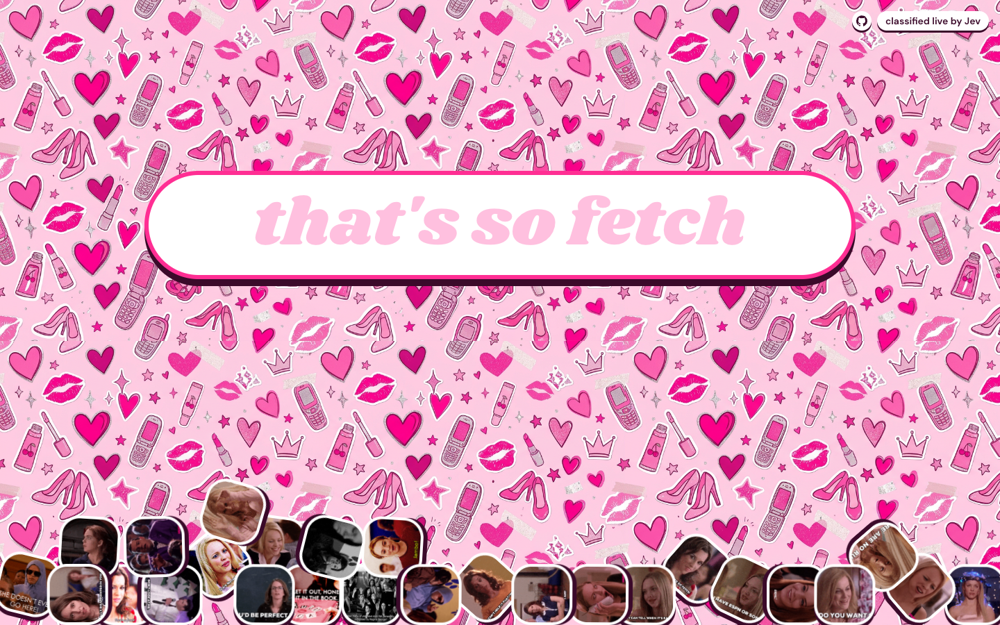

# Which Mean Girl Are You?

I made this for fun after watching _Mean Girls_ while the Jev model hype was going on. Type something a character might say, and Jev guesses who it sounds most like. The matching GIFs move toward your answer as you type. Try it here:

https://jev-mean-girls.vercel.app/



## Run it locally

```bash
bun install
```

Add your Jev API key to `.env.local`:

```dotenv
TYPESAFE_API_KEY=your_key_here
```

Then run `bun dev` and open [localhost:3000](http://localhost:3000).
